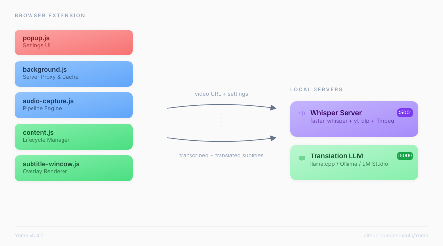

<div align="center">


# Yume

**Real-time AI subtitles for any video — fully local, no cloud APIs.**

Transcription · Translation · Romanization

[]()
[]()
[]()
[]()
[](https://github.com/jenox645/Yume/stargazers)
[](https://github.com/jenox645/Yume/commits/main)
[](https://github.com/jenox645/Yume/issues)
[](https://github.com/jenox645/Yume/actions)
[](LICENSE)

</div>

---

Yume captures audio from any video in your browser, transcribes it with [faster-whisper](https://github.com/SYSTRAN/faster-whisper) running on your GPU, translates it with a local LLM, and overlays subtitles in real-time. Everything runs on your machine. No API keys, no subscriptions, no data leaves your computer.

**Supported sites:** YouTube, NicoNico, Bilibili, Twitch, Crunchyroll, and [1000+ more](https://github.com/yt-dlp/yt-dlp/blob/master/supportedsites.md) via [yt-dlp](https://github.com/yt-dlp/yt-dlp/tree/master). Also works with direct stream URLs (m3u8, mp4).

**Source languages:** Japanese · Chinese · Korean · Russian · Arabic

**Subtitle output:** Original text → Romanization (Romaji / Pinyin / etc.) → Translation

---

## Features

- **Real-time subtitles** — transcription, translation, and romanization overlaid on any video
- **Fully local** — no cloud APIs, no subscriptions, no data leaves your machine
- **1000+ sites** — YouTube, NicoNico, Bilibili, Twitch, Crunchyroll, and all yt-dlp supported sites
- **Custom stream URLs** — paste m3u8 or mp4 URLs directly for sites that block yt-dlp
- **5 source languages** — Japanese, Chinese, Korean, Russian, Arabic with per-language hallucination filters
- **Romanization** — Romaji (JA, instant), Pinyin (ZH, instant), Revised Romanization (KO, instant), Latin transliteration (RU/AR, LLM)
- **SRT export** — export subtitles as .srt files from any session
- **Session restore** — subtitles survive page reloads within the same browser session
- **Hot model switching** — swap Whisper models without restarting the server
- **GPU stats dashboard** — live VRAM usage, GPU utilization, and temperature in the popup
- **Translation caching** — LRU cache avoids re-translating repeated lines (chorus, catchphrases)
- **Keyboard shortcut** — Alt+Y to toggle subtitles on/off
- **Timing offset slider** — adjust subtitle sync in real-time
- **Hallucination blacklist** — built-in + user-customizable filter for Whisper artifacts
- **Parallel pipeline** — transcribes chunk N+1 while translating chunk N
- **Benchmark tool** — compare Whisper model speeds on your hardware
- **Config export/import** — backup and restore your settings
- **Cross-platform** — Windows, Linux, macOS with auto-detection

---

## Quick Start

### 1. Launch Yume

| Platform | Command |
|----------|---------|
| Windows  | Double-click `START_YUME.bat` |
| Linux    | `./START_YUME.sh` |
| macOS    | Double-click `START_YUME.command` |

The setup wizard runs on first launch — it detects your hardware, installs dependencies (yt-dlp, FFmpeg, faster-whisper, translation model), and configures everything automatically.

### 2. Install the Extension

1. Open `chrome://extensions` (works in Chrome, Brave, Edge)
2. Enable **Developer Mode** (top-right toggle)
3. Click **Load unpacked** → select the `extension/` folder
4. Pin the Yume icon in the toolbar

**Firefox:**
1. Rename `manifest_firefox.json` to `manifest.json`, replacing the existing one
2. Go to `about:debugging`
3. This Firefox → Load Temporary Add-on → select `extension/manifest.json`
4. Pin the Yume icon in the toolbar

### 3. Watch

1. Go to any video with speech
2. Click the Yume icon → **Enable**
3. Subtitles appear automatically

**Tip:** Press **Alt+Y** to toggle subtitles without opening the popup.

---

## How It Works



The extension sends the video URL to the Whisper server, which downloads audio chunks via yt-dlp, transcribes them with faster-whisper, and returns timestamped segments. The extension then sends text to the translation LLM in parallel — transcribing chunk N+1 while translating chunk N.

**v5.1.0:** The server now starts accepting connections *before* the model finishes loading, so the extension can connect immediately and show "Loading model..." instead of "Server not reachable." A prewarm inference runs after loading to compile CUDA kernels, making the first real transcription faster.

---

## System Requirements

| | Minimum | Recommended |
|---|---------|-------------|
| **RAM** | 8 GB | 16+ GB |
| **GPU** | None (CPU works) | NVIDIA 4+ GB VRAM |
| **Disk** | 5 GB | 10+ GB |
| **Python** | 3.10 | 3.11+ |
| **OS** | Windows 10, Ubuntu 20.04, macOS 12 | Latest |

### GPU Support

| GPU | Status | Notes |
|-----|--------|-------|
| NVIDIA (CUDA) | Full support | Best performance. Auto-detected. |
| AMD (ROCm) | Linux only | RDNA2+ recommended. VRAM-aware compute tiers. |
| CPU | Always works | Slower. Recommended model: `small` or `base`. |

---

## Translation Backends

| Backend | How it works | Setup |
|---------|-------------|-------|
| **llama.cpp** (default) | Runs a GGUF model directly | Auto-installed by setup wizard |
| **Ollama** | Model management via CLI | [ollama.com](https://ollama.com) |
| **LM Studio** | GUI with model browser | [lmstudio.ai](https://lmstudio.ai) |
| **text-generation-webui** | Feature-rich web UI | [github](https://github.com/oobabooga/text-generation-webui) |
| **Custom** | Any OpenAI-compatible API | Point to your endpoint |

**Tip for faster loading:** Use Q4_K_M quantized GGUF models (7B–13B) and keep `n_ctx` low (512 is enough for subtitle translation). Store models on SSD for faster mmap paging.

---

## CLI Reference

```bash
python pocket_yume.py                # Interactive menu
python pocket_yume.py launch         # Start servers + runtime menu
python pocket_yume.py status         # Hardware, tools, packages, ports
python pocket_yume.py health         # Full end-to-end diagnostics
python pocket_yume.py fonts          # Detect installed CJK fonts
python pocket_yume.py benchmark      # Compare Whisper model speeds
python pocket_yume.py recommend      # Suggest best model for your hardware
python pocket_yume.py ports          # Port availability
python pocket_yume.py setup          # Re-run setup wizard
python pocket_yume.py export [path]  # Backup config
python pocket_yume.py import <path>  # Restore config
python pocket_yume.py blacklist list # Manage hallucination filter
python pocket_yume.py --verbose      # Enable debug logging
python pocket_yume.py help           # All commands
```

---

## Project Structure

```
Yume/
├── pocket_yume.py              CLI launcher & installer
├── config.py                   Configuration management
│
├── server/
│   ├── faster_whisper_server.py    Whisper STT + hallucination filter
│   └── requirements.txt
│
├── extension/                  Chrome/Brave/Edge extension (load this folder)
│   ├── manifest.json
│   ├── manifest_firefox.json
│   ├── popup.html / popup.js / popup.css
│   ├── js/
│   │   ├── background.js          Service worker (server proxy, translation cache)
│   │   ├── content.js             Content script (lifecycle, event wiring)
│   │   ├── audio-capture.js       Pipeline engine (chunking, parallel transcribe+translate)
│   │   ├── subtitle-window.js     Overlay renderer (drag, resize, RTL)
│   │   ├── debug-system.js        Structured logging
│   │   └── wanakana_min.js        Japanese romanization (offline)
│   ├── css/
│   ├── icons/
│   └── fonts/                  Custom font files (.ttf/.otf)
│
├── config/                     User settings (auto-generated)
├── models/translation/         GGUF model files
├── tools/                      yt-dlp, ffmpeg, deno (auto-downloaded)
├── logs/                       Server logs (auto-rotated)
└── START_YUME.bat/sh/command   Platform launchers
```

---

## Fonts

Yume detects installed system fonts automatically and groups them by language in the popup dropdown. CJK fonts (Japanese, Chinese, Korean, Arabic) are shown first when you select the matching source language.

### Custom fonts

Place `.ttf` or `.otf` files in `extension/fonts/`, add them to the `BUNDLED_FONTS` array in `popup.js`, and reload the extension. They'll appear as "(bundled)" in the font picker.

### Recommended free fonts

| Language | Font | Source |
|----------|------|--------|
| Japanese | Noto Sans JP | [Google Fonts](https://fonts.google.com/noto/specimen/Noto+Sans+JP) |
| Chinese (Simplified) | Noto Sans SC | [Google Fonts](https://fonts.google.com/noto/specimen/Noto+Sans+SC) |
| Chinese (Traditional) | Noto Sans TC | [Google Fonts](https://fonts.google.com/noto/specimen/Noto+Sans+TC) |
| Korean | Noto Sans KR | [Google Fonts](https://fonts.google.com/noto/specimen/Noto+Sans+KR) |
| Arabic | Noto Naskh Arabic | [Google Fonts](https://fonts.google.com/noto/specimen/Noto+Naskh+Arabic) |

Run `python pocket_yume.py fonts` to see which CJK fonts are already installed on your system.

## Troubleshooting

| Problem | Solution |
|---------|----------|
| Port already in use | `python pocket_yume.py ports` to find and kill the process |
| Whisper too slow | `python pocket_yume.py recommend` for the best model for your GPU |
| Extension can't connect | Check both dots are green in the popup. Restart servers if needed. |
| No subtitles on music | Whisper drops quiet vocals. Thresholds are tuned for music in v5.0+. |
| Non-YouTube site blocked (403) | Copy the m3u8/mp4 URL from DevTools Network tab → paste as Custom Stream URL |
| Translation shows source text | Fixed in v5.0. If it persists, check your LLM server is running. |
| Arabic text renders wrong | v5.0+ adds RTL support. Update to latest version. |
| "Server not reachable" briefly on start | Normal — server starts before model loads. Extension auto-retries until ready. |

---

## Security

- **API token auth**: Random token per session, required for all server endpoints except `/health`
- **DNS rebinding protection**: Host header validation rejects non-localhost requests
- **URL sanitization**: All URLs validated before passing to subprocess
- **Token discovery**: Extension-only — web pages cannot obtain the API token

---

## Changelog

### v5.4.0
- **Removed**: `yume_doctor.py` (redundant with `health` command)
- **Fixed**: GPL license conflict — switched `korean_romanizer` (GPL-v3) to `romanization` (MIT)
- **Fixed**: Translation server indicator showing red when working (token leak to non-Whisper servers, non-JSON crash, no auto-refresh)
- **Fixed**: Benchmark no longer says "will download" when model is already cached
- **Fixed**: Test Translation and Benchmark now available in Runtime menu (where servers are running)
- **Fixed**: Dead code removed — unreachable `_signalReady` in empty-chunk branches
- **Fixed**: `_fetchChunk`/`_transcribeOnly` duplication — extracted shared `_transcribeAndFilter` helper
- **Fixed**: `reRomanizeCachedChunks` now uses batch endpoint (1 call per chunk, not per segment)
- **Added**: Glass effect on subtitle window (toggle + blur slider + corner radius, in Appearance settings)
- **Added**: Translation prompt editor in CLI (Settings → Translation Prompt) with 5 style presets
- **Added**: Custom translation prompts used by both single and batch translation
- **Added**: GitHub Actions CI workflow (syntax, JSON, version consistency, pytest)
- **Added**: `.editorconfig` for consistent formatting across contributors
- **Added**: `tests/` with 32 pytest tests (config, URL validation, version consistency)
- **Added**: 14 ARIA attributes on popup interactive elements
- **Added**: `turbo` (large-v3-turbo) to model list and benchmark with download status
- **Added**: Auto-refresh server status every 12s while popup is open
- **Improved**: All CLI jargon replaced with plain explanations (STT, TL, VRAM, distil, hallucination, GGUF, Deno, CJK, etc.)

### v5.3.0
- **Added**: BatchedInferencePipeline support (faster-whisper batched inference, up to 12.5x speedup potential)
- **Added**: `whisper-large-v3-turbo` model support (near-v3 accuracy at 2x speed, recommended for 7-10GB VRAM)
- **Added**: Batch romanization endpoint (`/romanize_batch`) — single HTTP round trip for N segments
- **Added**: `CONTRIBUTING.md` with development setup and PR guidelines
- **Improved**: `_romanizeBatch` uses single batch call instead of N sequential round trips (~400ms → ~5ms for ja/zh/ko)
- **Improved**: Model recommendation now includes turbo tier between distil and large-v3
- **Improved**: Model switch rebuilds BatchedInferencePipeline wrapper

### v5.2.0
- **Fixed P0**: Extension update no longer wipes user settings (only fresh install resets)
- **Fixed P0**: Server returns 503 during model loading (prevents crash on early requests)
- **Fixed P1**: Language change no longer triggers double pipeline restart
- **Fixed P1**: Storage listener leak on AudioCapture recreation (cleaned up on stop)
- **Fixed P1**: `.yume_token` added to `.gitignore` (API secret no longer committed)
- **Fixed P1**: Config defaults now match server defaults (`pause_threshold`, `word_timestamps`)
- **Fixed**: URL validation rejects empty scheme (defense-in-depth)
- **Fixed**: Translation batch `max_tokens` scales with segment count (no more truncation)
- **Fixed**: Removed dead wanakana import from background worker (faster startup)
- **Fixed**: Removed dead config fields (`use_batched_pipeline`, `batch_size`)
- **Added**: Korean deterministic romanization via `korean_romanizer` (~1ms vs 1-10s LLM)
- **Added**: `numpy` to requirements.txt (prewarm inference no longer silently skips)
- **Added**: Project mascot banner in README
- **Improved**: Health endpoint returns HTTP 503 during loading (cleaner extension retry)

### v5.1.0
- **Fixed**: Background service worker wanakana import (wrong path + module type conflict)
- **Fixed**: Session-restore ready signal now checks for actual content at playback position
- **Fixed**: Update checker now points to correct GitHub repository
- **Fixed**: YouTube URL validation uses proper hostname parsing (prevents spoofing)
- **Improved**: Server starts accepting connections before model loads (faster perceived startup)
- **Improved**: Prewarm inference compiles CUDA kernels at startup (faster first transcription)
- **Improved**: Cache key separators prevent theoretical key collisions
- **Improved**: Manifest description updated for all supported languages
- **Added**: Full feature list in README

### v5.0.0
- All 6 priority bugs from v4.9.0 review fixed
- Translation fallback no longer shows source text as translation
- 120s timeout for consumer LLMs
- Music-optimized Whisper thresholds
- RTL Arabic subtitle support
- Batch translation with LRU caching

---

## License

MIT
