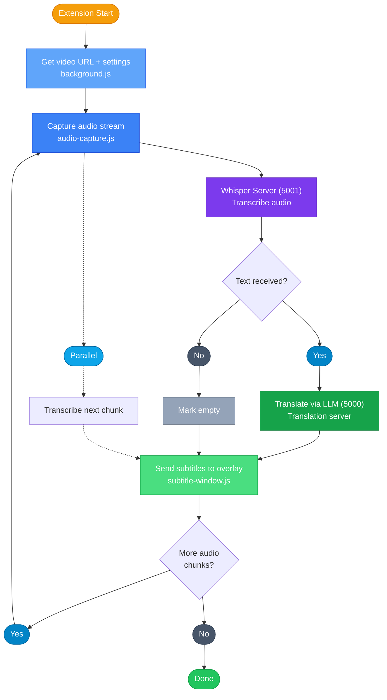
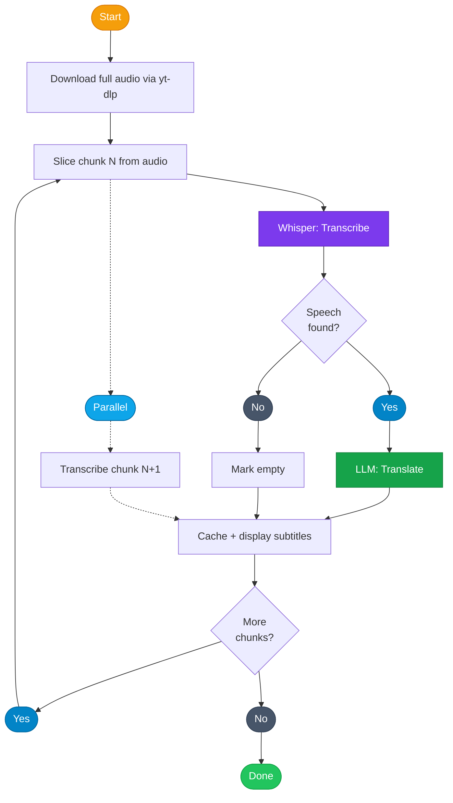

<div align="center">


# Yume

**Real-time AI subtitles for any video — fully local, no cloud APIs.**

Transcription · Translation · Romanization

[]()
[]()
[]()
[]()
[](https://github.com/jenox645/Yume/stargazers)
[](https://github.com/jenox645/Yume/commits/main)
[](https://github.com/jenox645/Yume/actions)
[](LICENSE)

</div>

---

https://github.com/user-attachments/assets/48ee3790-7635-4321-8246-308689e53210


Yume captures audio from any video in your browser, transcribes it with [faster-whisper](https://github.com/SYSTRAN/faster-whisper) running on your GPU, translates it with a local LLM, and overlays subtitles in real-time. Everything runs on your machine — no API keys, no subscriptions, no data leaves your computer.

**Supported sites:** YouTube, NicoNico, Bilibili, Twitch, Crunchyroll, and [1000+ more](https://github.com/yt-dlp/yt-dlp/blob/master/supportedsites.md) via yt-dlp

**Source languages:** Japanese · Chinese · Korean · Russian · Arabic

---

|  |  |
|:---:|:---:|
|  |  |

## Quick Start

**1. Launch Yume**

| Platform | Command |
|----------|---------|
| Windows  | Double-click `START_YUME.bat` |
| Linux    | `./START_YUME.sh` |
| macOS    | Double-click `START_YUME.command` |

The setup wizard runs on first launch — detects your hardware, installs dependencies, and configures everything.

**2. Install the Extension**

1. Open `chrome://extensions` (Chrome, Brave, Edge)
2. Enable **Developer Mode** (top-right)
3. **Load unpacked** → select the `extension/` folder
4. Pin the Yume icon

> **Firefox:** Rename `manifest_firefox.json` → `manifest.json`, then `about:debugging` → Load Temporary Add-on

**3. Watch**

1. Go to any video → Click Yume icon → **Enable**
2. Subtitles appear automatically
3. Press **Alt+Y** to toggle without opening the popup

---

## Architecture



---

## Real-time Pipeline



Yume hides latency by **transcribing chunk N+1 while translating chunk N** — Whisper and the LLM never wait for each other.


---

## Whisper Models

Yume uses [faster-whisper](https://github.com/SYSTRAN/faster-whisper) (CTranslate2) for speech-to-text. Models are downloaded automatically on first use.

### Available models

| Model | Size | Speed | Quality | VRAM |
|-------|------|-------|---------|------|
| tiny | ~75 MB | Fastest | Low | ~1 GB |
| base | ~140 MB | Fast | Fair | ~1 GB |
| small | ~460 MB | Medium | Good | ~2 GB |
| medium | ~1.5 GB | Slow | Very good | ~5 GB |
| large-v3 (default) | ~3 GB | Slowest | Best | ~10 GB |
| distil-large-v3 | ~1.5 GB | Fast | Near large-v3 | ~4 GB |

Switch models via the popup (Whisper Model section) or CLI: **Settings → Whisper Model**.

### Where models are stored

faster-whisper downloads models from HuggingFace into your system cache:

| OS | Path |
|----|------|
| Windows | `C:\Users\<you>\.cache\huggingface\hub\` |
| Linux | `~/.cache/huggingface/hub/` |
| macOS | `~/.cache/huggingface/hub/` |

Models appear as directories named `models--Systran--faster-whisper-large-v3/` (etc). The actual CTranslate2 weights are inside `snapshots/<hash>/`. These are **not** inside the Yume folder — they're shared across all applications that use HuggingFace models.

To free disk space, delete the model directories you no longer need. Yume will re-download them if you switch back.

### Using a custom or fine-tuned model

faster-whisper accepts a local directory path instead of a model name. To use your own model (e.g., a fine-tuned Whisper for song lyrics):

1. **Convert to CTranslate2 format** (if you have a HuggingFace or OpenAI checkpoint):
   ```bash
   pip install ctranslate2
   ct2-openai-whisper-converter --model /path/to/whisper-checkpoint --output_dir /path/to/ct2-model
   ```
   Or for a HuggingFace model:
   ```bash
   ct2-transformers-converter --model openai/whisper-large-v3 --output_dir /path/to/ct2-model --quantization float16
   ```

2. **Set the model path in config** (`yume_config.json`):
   ```json
   {
     "whisper_model": "/absolute/path/to/your/ct2-model"
   }
   ```

3. **Restart Yume** — the server will load your model instead of downloading from HuggingFace.

The directory must contain `model.bin`, `config.json`, `tokenizer.json`, and `vocabulary.txt` (standard CTranslate2 Whisper layout). If any are missing, faster-whisper will fail with a clear error.

> **Note:** Custom model paths cannot be selected via the popup model switcher (it only shows standard models). Use the config file or launch the server manually with `--model /path/to/model`.

---

## Translation Models

Yume uses a local LLM to translate subtitles. Recommended models:

| Model | Size | Speed | Quality | Best for |
|-------|------|-------|---------|----------|
| Qwen2.5-3B-Q6 | ~2.5 GB | Medium| Good | Low VRAM, fast subtitles |
| Mistral-7B-Q4 | ~4.5 GB | Slow| Very good | Most users |
| Qwen2.5-7B-Q4 | ~4.5 GB | Slow| Very good | CJK languages |
| Shisa-v2-Nemo-12B-Q6 | ~10 GB | | Excellent | Best translation quality |
| Qwen2.5-14B-Q4 | ~9 GB | | Excellent | Premium CJK quality |

Download via CLI: **Tools → Download Translation Model**

### Translation Backends

| Backend | Setup | Notes |
|---------|-------|-------|
| **llama.cpp** (default) | Auto-installed by wizard | Runs GGUF models directly |
| **Ollama** | [ollama.com](https://ollama.com) | One-click install, model management |
| **LM Studio** | [lmstudio.ai](https://lmstudio.ai) | GUI with model browser |
| **Custom** | Your endpoint | Any OpenAI-compatible API |

---

## System Requirements

| | Minimum | Recommended |
|---|---------|-------------|
| **RAM** | 8 GB | 16+ GB |
| **GPU** | None (CPU works) | NVIDIA 4+ GB VRAM |
| **Disk** | 5 GB | 10+ GB |
| **Python** | 3.10 | 3.11+ |

| GPU | Support | Notes |
|-----|---------|-------|
| NVIDIA (CUDA) | Full | Best performance. Auto-detected via CTranslate2. |
| AMD (ROCm) | Linux | RDNA2+ recommended. |
| CPU | Always | Slower. Use `small` or `base` model. |

---

## CLI Reference

```bash
python pocket_yume.py                # Interactive menu
python pocket_yume.py launch         # Start servers + runtime menu
python pocket_yume.py status         # Hardware, tools, packages, ports
python pocket_yume.py health         # Full end-to-end diagnostics
python pocket_yume.py benchmark      # Compare Whisper model speeds
python pocket_yume.py recommend      # Suggest best model for your GPU
python pocket_yume.py fonts          # Detect installed subtitle fonts
python pocket_yume.py setup          # Re-run setup wizard
python pocket_yume.py help           # All commands
```

---

## YouTube Authentication

YouTube blocks automated downloads to prevent bots. Yume supports two methods to authenticate:

| Method | How it works | Requirements | Best for |
|--------|-------------|--------------|----------|
| **Browser Cookies** (default) | Borrows your YouTube login from Chrome/Firefox/Edge | Be logged into YouTube in your browser | Most users |
| **Deno** | Runs a local server that solves YouTube's bot challenge | Deno installed + internet connection | Users without a YouTube account |

**Browser Cookies** is the default and recommended option. During first-time setup, Yume asks which browser you use. It reads your YouTube session cookie (read-only, never modified) and passes it to yt-dlp for authenticated downloads.

**Deno mode** is for users who don't want to link a YouTube account. Yume downloads [Deno](https://deno.land) (~35 MB), clones the [bgutil-ytdlp-pot-provider](https://github.com/Brainicism/bgutil-ytdlp-pot-provider) server, and runs it locally on port 4416. This server solves YouTube's BotGuard challenge and generates "proof-of-origin" (PO) tokens that prove you're a real browser. It requires an active internet connection to fetch challenges from YouTube.

Change the method anytime: **Settings > YouTube Auth**

---

## Troubleshooting

| Problem | Solution |
|---------|----------|
| "YouTube requires sign-in" | Settings > YouTube Auth > Browser Cookies > pick your browser |
| Port already in use | `python pocket_yume.py ports` to find and kill the process |
| Whisper too slow | `python pocket_yume.py recommend` for the best model |
| Extension can't connect | Check both dots are green in the popup |
| No subtitles on music | Thresholds are tuned for music in v5.0+ |
| Translation server red dot | Fixed in v5.4.2 — update to latest |
| Auto-detect picks CPU with NVIDIA | Fixed in v5.6.0 — uses CTranslate2 detection |
| "Server not reachable" on start | Normal — server loads model first, extension retries |
| First 30s show "no speech" | If the song has an instrumental intro, this is normal |
| `cublas64_12.dll not found` | CUDA Toolkit incomplete — install from https://developer.nvidia.com/cuda-downloads or `pip install nvidia-cublas-cu12`. Yume auto-falls back to CPU in v5.7.0. |
| Japanese shows but English is empty | Fixed in v5.6.0 — translation parser now handles unnumbered LLM responses |
| All chunks show "empty" after re-run | Press Clear Cache in the popup, then re-enable. Fixed in v5.6.0. |

### Known Limitations

These are design or upstream limitations, not bugs:

- **Whisper misses soft vocals over loud music** — Whisper's internal voice activity detection is not tuned for singing. First 10-15 seconds of quiet vocals over instrumentation may be missed. Fix requires fine-tuning the Whisper model (training package exists).
- **Translation is slow on large models** — A 12B Q6 model takes 10-20 seconds per dense chunk on consumer GPUs. Use a 3B or 7B model for faster subtitles, or wait for NLLB fast-translation mode (planned).
- **`word_timestamps` and `pause_threshold` config keys have no effect** — The server hardcodes these values for music optimization. They exist in config but changing them does nothing. Tracked as known technical debt.

---

## Security

- **Per-session API token** — random 32-byte token, required for all endpoints
- **DNS rebinding protection** — Host header validation blocks non-localhost
- **URL sanitization** — all URLs validated before subprocess calls
- **Extension-only token** — web pages cannot obtain the API token
- **Cookie access** — read-only browser cookie access for YouTube auth (never modified)
- **No shell invocation** — all subprocess calls use explicit argv lists; no `shell=True`, no `os.system()`, no `curl | sh`
- **XSS prevention** — all dynamic content in popup innerHTML is escaped; subtitle overlay uses `textContent` only
- **Pinned dependencies** — all Python packages pinned to exact versions to prevent supply-chain attacks

---

<details>
<summary><strong>Requirements &amp; Dependencies</strong></summary>

### Python Packages (Whisper Server)

Installed automatically by the setup wizard via `server/requirements.txt`:

| Package | Version | Purpose |
|---------|---------|---------|
| faster-whisper | 1.2.1 | Speech-to-text (CTranslate2 Whisper) |
| flask | 3.1.3 | HTTP server framework |
| flask-cors | 6.0.2 | Cross-origin requests from extension |
| waitress | 3.0.2 | Production WSGI server (replaces Flask dev server) |
| numpy | 2.4.3 | Audio array processing |
| pykakasi | 2.3.0 | Japanese romanization |
| pypinyin | 0.55.0 | Chinese romanization |
| romanization | 2.0.0 | Korean romanization |

### Translation Backend Packages

Only needed if using the built-in llama.cpp backend (installed by wizard):

| Package | Version | Purpose |
|---------|---------|---------|
| llama-cpp-python | latest | Local LLM inference (GGUF models) |
| uvicorn | 0.42.0 | ASGI server for llama.cpp |
| fastapi | 0.135.1 | API framework for llama.cpp server |
| sse-starlette | 3.3.3 | Server-sent events (streaming) |
| pydantic-settings | 2.13.1 | Settings management |

Not needed if using Ollama, LM Studio, or a custom backend.

### GPU Acceleration

| GPU | Toolkit | How Yume uses it |
|-----|---------|-----------------|
| **NVIDIA (CUDA)** | [CUDA Toolkit 12.x](https://developer.nvidia.com/cuda-downloads) | faster-whisper uses CTranslate2 (auto-detected). llama.cpp uses cuBLAS. Both installed automatically. If `cublas64_12.dll not found` appears, run `pip install nvidia-cublas-cu12`. |
| **AMD (ROCm)** | [ROCm 6.x](https://rocm.docs.amd.com/) (Linux only) | llama-cpp-python builds with `-DGGML_HIP=on`. Requires `rocm-hip-runtime` and `rocm-hip-sdk`. RDNA2+ recommended. |
| **CPU** | None | Always works. Use `small` or `base` Whisper model. Translation is slower — use a 3B model. |

### System Tools

Downloaded automatically to `tools/` by the setup wizard:

| Tool | Purpose | Source |
|------|---------|--------|
| yt-dlp | Audio download from 1000+ sites | [github.com/yt-dlp/yt-dlp](https://github.com/yt-dlp/yt-dlp) |
| FFmpeg | Audio conversion (→ 16kHz mono WAV) | [github.com/BtbN/FFmpeg-Builds](https://github.com/BtbN/FFmpeg-Builds) |
| Deno | YouTube PO token generation (optional) | [deno.land](https://deno.land) |

### Build Tools (Linux / macOS only)

Required to compile llama-cpp-python from source. Not needed on Windows (uses prebuilt wheels).

| Distro | Install command |
|--------|----------------|
| Fedora / RHEL | `sudo dnf install ninja-build cmake gcc-c++` |
| Ubuntu / Debian | `sudo apt install ninja-build cmake g++` |
| macOS | `brew install ninja cmake` |
| Arch | `sudo pacman -S ninja cmake gcc` |

The setup wizard attempts to install these automatically.

### Browser Extension

| Requirement | Details |
|-------------|---------|
| Chrome / Brave / Edge | Manifest V3, load unpacked from `extension/` |
| Firefox | Rename `manifest_firefox.json` → `manifest.json`, load via `about:debugging` |
| Permissions | `tabCapture` (audio), `storage` (settings), `activeTab` |

</details>

<details>
<summary><strong>Changelog</strong></summary>

### v0.0.8

**Bug Fixes**
- Fixed "Ready ✓" showing before any subtitles exist (instrumental intros, silence).
- Fixed URL validation blocking `&` in YouTube URLs (playlist/timestamp links).
- Fixed first 30s skipped — chunk 0 always fetched first regardless of playback position.
- Improved speech detection after silence (`no_speech_threshold` 0.45 → 0.3).
- Fixed romanization showing kanji instead of romaji — pykakasi background thread with 60s timeout.
- Fixed pipeline stopping at 8/10 chunks — translation failures retry 3x without re-transcribing.

**Performance**
- Parallel translation + romanization via `Promise.all` — up to 50% lower latency.

**Performance**
- Server startup ~5-10s faster (parallel yt-dlp/ffmpeg checks via ThreadPoolExecutor).
- pykakasi dictionary loads during Whisper model load, not after (~15s head start).

**Security**
- URL validation before all subprocess calls (yt-dlp, ffmpeg) — blocks injection via shell metacharacters.
- Removed `shell=True` from Ollama installer, `os.system()` calls, and `chcp` codepage changes.
- Replaced `curl | sh` Ollama install with download-then-execute.
- XSS fixes in popup (model info, diagnostics) — all server responses HTML-escaped.
- Unix tool permissions tightened from `0o755` to `0o750`.
- Dependencies pinned to exact versions (`==`) to prevent supply-chain attacks.

**CI/CD & Tooling**
- CI expanded from 2 to 6 jobs: lint, test+coverage, quality (radon/vulture), security (bandit/pip-audit), call graphs (pyan3), JS lint (ESLint).
- Pre-commit hooks (ruff, bandit, eslint), Dependabot, local analysis runner (`python tools/analyze.py all`).

**Quality**
- Full Ruff cleanup (470 violations resolved). Duplicated API path strings extracted to constants.
- Hardcoded localhost URLs replaced with central helpers. Custom Whisper model support in popup.
- Romanization prompt editor, `large-v3-turbo` model support, model download status in CLI.
- Rich error diagnostics on server crash (CUDA OOM, missing libs, permissions).
- Windows terminal crash fix (`SetConsoleCtrlHandler`), macOS AirPlay port conflict detection.

### v0.0.7

- Reset version scheme to proper semver (was inflated to 5.x for a pre-alpha project).
- Fixed Whisper forced to CPU when config said `auto`; CLI-resolved GPU now takes priority.
- Fixed temp directory leak on failed downloads, partial downloads leaving corrupt files.
- Fixed XSS in popup diagnostics via unescaped `entry.details`.
- Fixed translation cache serving stale results after model switch (added 30-min TTL).
- Fixed `_slice_audio` crash if source audio was deleted mid-operation.
- Fixed `UnicodeDecodeError` on non-UTF-8 model metadata.
- Added `SECURITY.md`, PR template, AST-based import completeness tests.
- Added setup wizard installation summary with per-component pass/fail.
- Prewarm now detects CUDA library failures and falls back to CPU automatically.

### v0.0.6

- Fixed update check freezing the menu when offline (now runs in a background thread).
- Fixed disk space check missing before large downloads.
- Fixed invalid JSON config crashing silently (now warns and falls back to defaults).
- Fixed corner radius wrongly tied to the Glass Effect toggle.
- Fixed translation server status showing incorrect state when busy (socket fallback).
- Settings now show the resolved device (e.g. `cuda (auto)` instead of just `auto`).

### v0.0.5

- Fixed server startup crash (`import logging` missing).
- Fixed `_get_audio_duration` removed by accident; restored to fix `/prepare` failures.
- Fixed stream URL cache never evicted; max size now enforced.
- Fixed excessive werkzeug logging in non-verbose mode.
- Server stats now track cache misses; ffmpeg availability checked on startup.

### v0.0.4

- Fixed YouTube auth — proper Deno PO token support via bgutil server (port 4416).
- Fixed stale API token after server restart — extension now auto-recovers on 403.
- Fixed auto-detect GPU choosing CPU even with NVIDIA present (uses CTranslate2 detection).
- Default YouTube auth switched from `deno` to `cookies`.

### v0.0.3

- Added translation prompt editor and romanization prompt editor to settings.
- Added config export/import with timestamped backups.

### v0.0.2

- Fixed translation silently empty — batch parser dropped translations without `[N]` markers.
- Fixed server caching empty transcription results forever.
- Fixed session storage restoring stale chunks on page reload.
- Added integration tests, dead config detection test, GitHub CI, issue templates.
- Added `--version` CLI flag; diagnostics now show `[cached]` tag.

### v0.0.1

- Initial public release.
- Music-optimized Whisper (VAD off, pause threshold 0.25s), RTL Arabic support, batch translation, parallel pipeline, Glass effect subtitle window.
- Cross-platform CLI with setup wizard, GPU auto-detection, tool installers.
- Per-session API token, DNS rebinding protection, URL sanitization.

</details>

---

## Contributing

See [CONTRIBUTING.md](CONTRIBUTING.md) for development setup and guidelines.

## License

MIT
