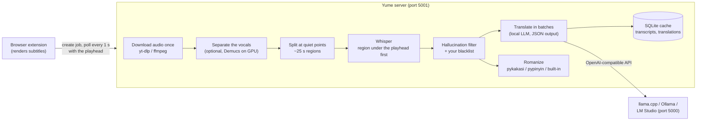

<div align="center">


# Yume

### YUME-chan — *You'll Understand More Easily*

**Real-time AI subtitles for any video — fully local, no cloud APIs.**

Transcription · Translation · Romanization


[](https://github.com/jenox645/Yume/stargazers)
[](https://github.com/jenox645/Yume/commits/main)
[](LICENSE)

</div>

---

https://github.com/user-attachments/assets/48ee3790-7635-4321-8246-308689e53210

Yume fetches the audio of the video you are watching (via [yt-dlp](https://github.com/yt-dlp/yt-dlp)), transcribes it with [faster-whisper](https://github.com/SYSTRAN/faster-whisper), translates it with a local LLM, and overlays subtitles in your browser. Everything runs on your machine — no API keys, no subscriptions, no data leaves your computer except the audio download itself.

**Tested sites:** YouTube, NicoNico, Bilibili, Twitch. Other sites may work via [yt-dlp](https://github.com/yt-dlp/yt-dlp/blob/master/supportedsites.md), but are not guaranteed — authentication and bot protection vary widely, and DRM-protected services (Netflix, Crunchyroll, most paid streaming) cannot be downloaded at all.

**Source languages:** Japanese · Chinese · Korean · Russian · Arabic

> **Note:** This is an early-stage personal project. Expect rough edges. Contributions and bug reports are welcome.

### What's new in 0.2

- **Vocal isolation** — on an NVIDIA GPU, Yume separates the singer from the music before Whisper listens (Demucs). Fewer misheard lyrics; install it from **Tools → Vocal Isolation** or the setup wizard.
- **One-click start** — press Enable in the extension and Yume starts by itself in the background, and stops when you stop watching.
- **GPU translation without compiling anything** — llama.cpp's prebuilt `llama-server`, matched to your driver: a whole song is translated in seconds.
- **The server does the work** — download once, ~25 s sections cut at quiet points, the part you are watching first, everything cached in SQLite: reopening a video is instant, in any browser.
- **Made for songs in five languages** — hallucinations Whisper invents over music ("subtitles by …", "see you in the next video") are hidden in Japanese, Chinese, Korean, Russian and Arabic; Korean romanization follows pronunciation; `large-v3-turbo` is the default (as accurate as `large-v3` on songs, twice as fast).

---

|  |  |
|:---:|:---:|
|  |  |

---

## Quick Start

**1. Launch Yume**

| Platform | Command |
|----------|---------|
| Windows  | Double-click `START_YUME.bat` |
| Linux    | `./START_YUME.sh` |
| macOS    | Double-click `START_YUME.command` |

The setup wizard runs on first launch — detects your hardware, installs dependencies (yt-dlp, FFmpeg, faster-whisper, translation model), and configures everything. At the end it offers **one-click start**: say yes and you never need to open the launcher again — the extension starts Yume by itself (see step 3).

**2. Install the Extension**

Chrome, Brave, Edge:
1. Open `chrome://extensions`
2. Enable **Developer Mode** (top-right toggle)
3. Click **Load unpacked** → select the `extension/` folder
4. Pin the Yume icon in the toolbar

Firefox (121+): open `about:debugging` → **This Firefox** → **Load Temporary Add-on** → select `extension/manifest.json` (the same manifest works in every browser). Note: temporary add-ons unload when Firefox closes — re-load after each restart (Chrome/Edge/Brave installs persist).

**3. Watch**

1. Go to any video with speech
2. Click the Yume icon → **Enable** (or press **Alt+Y**)
3. With one-click start on, Yume starts in the background if it isn't running (the first start takes ~30 s while the models load); otherwise launch it with `START_YUME` first
4. Subtitles appear as soon as the first section is transcribed

**One-click start** (`python pocket_yume.py autostart on`, or **Settings → One-click start**) registers a small helper with Chrome, Edge, Brave and Firefox. When you press Enable and Yume is not running, the extension asks the helper to start it — no window, no terminal. It stops by itself after 30 minutes without a video (configurable; 0 = never), and the popup has **Start Yume** / **Stop Yume** buttons. Background logs are in `logs/service.log`. Turn it off with `python pocket_yume.py autostart off`.

> **Heads up:** Yume downloads the video's audio before transcribing. The first 30 seconds are transcribed straight from the stream while the full download runs, so the first subtitles usually appear within ~10–20 seconds. Videos you have already watched load instantly from the cache.

---

## How It Works


```mermaid
graph LR
    EXT["Browser extension<br/>(renders subtitles)"] -- "create job, poll every 1 s<br/>with the playhead" --> SRV
    subgraph SRV ["Yume server (port 5001)"]
        DL["Download audio once<br/>yt-dlp / ffmpeg"] --> SEP["Separate the vocals<br/>(optional, Demucs on GPU)"]
        SEP --> RG["Split at quiet points<br/>~25 s regions"]
        RG --> WH["Whisper<br/>region under the playhead first"]
        WH --> FL["Hallucination filter<br/>+ your blacklist"]
        FL --> TR["Translate in batches<br/>(local LLM, JSON output)"]
        FL --> RO["Romanize<br/>pykakasi / pypinyin / built-in"]
        TR --> DB[("SQLite cache<br/>transcripts, translations")]
    end
    TR -- "OpenAI-compatible API" --> LLM["llama.cpp / Ollama /<br/>LM Studio (port 5000)"]
```

The extension only renders: it asks the server for a job for the current video and polls it. The server does everything else and caches it, so reopening a video — in any browser — shows its subtitles instantly. Whisper and the LLM run in parallel (section N+1 is transcribed while section N is translated), and both start at whatever part of the video you are watching, so seeking re-prioritises the work.

---

## Benchmark

Real-world numbers on an **RTX 3060 12 GB VRAM** (a mid-range card):

Measured with `large-v3-turbo` and Qwen2.5-7B Q3_K_M on the GPU build of `llama-server`:

| Step | Time | Details |
|------|------|---------|
| Start Yume | ~8 s | Enable in the extension → both servers ready (models already downloaded) |
| First subtitle of a new 4–5 min song | 4–9 s | audio download + first section, translated (Korean, Chinese, Russian, Arabic music videos) |
| Whole 4–5 min song | 25–60 s | every line transcribed, translated and romanized |
| 75-minute video opened at 40:00 | ~20 s | to the first translated line at 40:00 (the 75 min of audio download in ~17 s) |
| Whisper, one ~25 s section | ~0.6 s | `large-v3` takes twice as long |
| Translation, 10 lines | 4–6 s | keeps up with dense speech: the line on screen was translated 97% of the time |
| Vocal isolation, 4-min song | ~8 s | Demucs on the GPU, 0.6 GB VRAM; then every section is transcribed from the vocals |
| A video watched before | instant | everything is cached |

Accuracy on two Japanese songs, measured against their lyrics (characters wrong, scored on the reading so 幻 and マボロシ count as the same):

| | "One more kiss" | "Purple Dream" | Time per song |
|---|---|---|---|
| `large-v3-turbo` | 14.0% | 8.1% | ~5 s |
| `large-v3-turbo` + vocal isolation | **11.7%** | **7.9%** | ~13 s |
| `large-v3` | 25.7% | 9.4% | ~9 s |

`large-v3-turbo` is the recommended Whisper model on any GPU.

We also tried [Qwen3-ASR](https://github.com/QwenLM/Qwen3-ASR) (January 2026), which beats Whisper on published singing benchmarks: on these songs it was less accurate (17.0% / 15.0%) and 4–10× slower, so Yume stays on Whisper.

Smaller models are faster at the cost of accuracy — a 3B translation model, or `small` Whisper on a CPU. Use `python pocket_yume.py benchmark` to measure your own hardware, and `python pocket_yume.py recommend` to get a model suggestion based on your GPU.

---

## Translation Models

| Model | Size | Speed | Quality | Best for |
|-------|------|-------|---------|----------|
| Qwen2.5-3B-Q6 | ~2.5 GB | Fast | Good | Low VRAM, faster subtitles |
| Mistral-7B-Q4 | ~4.5 GB | Medium | Very good | General use |
| Qwen2.5-7B-Q4 | ~4.5 GB | Medium | Very good | CJK languages |
| Shisa-v2-Nemo-12B-Q6 | ~10 GB | Slow | Excellent | Best translation quality |
| Qwen2.5-14B-Q4 | ~9 GB | Slow | Excellent | Premium CJK quality |

Note: large models (12B+) take 10–20 seconds per section on consumer GPUs. Use a 3B or 7B model if subtitle delay is a concern. The Whisper model and the translation model share your GPU's VRAM.

Download via CLI: **Tools → Download Translation Model**

### Translation Backends

| Backend | Setup | Notes |
|---------|-------|-------|
| **llama.cpp** (default) | Auto-installed by wizard | Runs GGUF models directly with llama.cpp's prebuilt server — CUDA, Vulkan, Metal or CPU build picked for your hardware (**Tools → Translation Engine** to update) |
| **Ollama** | [ollama.com](https://ollama.com) | One-click install, model management (0.5+ for structured output) |
| **LM Studio** | [lmstudio.ai](https://lmstudio.ai) | GUI with model browser |
| **Custom** | Your endpoint | Any OpenAI-compatible API |

For every backend except llama.cpp, set the model name in **Settings → Translation settings → Manage model** — Ollama and LM Studio need it in every request.

---

## System Requirements

| | Minimum | Recommended |
|---|---------|-------------|
| **RAM** | 8 GB | 16+ GB |
| **GPU** | None (CPU works) | NVIDIA 8+ GB VRAM (Whisper + a 7B translation model) |
| **Disk** | 5 GB | 15+ GB (with vocal isolation: +3.5 GB) |
| **Python** | 3.10 | 3.11+ |

| GPU | Support | Notes |
|-----|---------|-------|
| NVIDIA (CUDA) | Full | Best performance. Auto-detected via CTranslate2. Vocal isolation needs a driver with CUDA 12.6+. |
| AMD (ROCm) | Linux only | RDNA2+ recommended. |
| CPU | Always | Slower. Use `small` or `base` Whisper model. |

---

## CLI Reference

```bash
python pocket_yume.py                # Interactive menu
python pocket_yume.py launch         # Start servers + runtime menu
python pocket_yume.py serve          # Start servers in the background (no window, auto-stops when idle)
python pocket_yume.py stop           # Stop the background servers
python pocket_yume.py autostart on   # Let the extension start/stop Yume by itself (off / status)
python pocket_yume.py status         # Hardware, tools, packages, ports
python pocket_yume.py health         # Full end-to-end diagnostics
python pocket_yume.py benchmark      # Compare Whisper model speeds
python pocket_yume.py recommend      # Suggest best model for your GPU
python pocket_yume.py fonts          # Detect installed subtitle fonts
python pocket_yume.py setup          # Re-run setup wizard
python pocket_yume.py settings       # Settings menu
python pocket_yume.py help           # All commands
```

---

## YouTube Authentication

YouTube blocks automated downloads to prevent bots. Yume supports two methods:

| Method | How it works | Requirements | Best for |
|--------|-------------|--------------|----------|
| **Browser Cookies** (default) | Borrows your YouTube login from Chrome/Firefox/Edge | Be logged into YouTube in your browser | Most users |
| **Deno** | Runs a local server that solves YouTube's bot challenge | Internet connection | Users without a YouTube account |

**Browser Cookies** is the default. Yume reads your YouTube session cookie (read-only, never modified) and passes it to yt-dlp for authenticated downloads.

**Deno mode** downloads [Deno](https://deno.land) (~35 MB), runs a local [bgutil](https://github.com/Brainicism/bgutil-ytdlp-pot-provider) server on port 4416, and uses it to generate proof-of-origin tokens. Requires an internet connection. Switch anytime via **Settings > YouTube Auth**.

---

## Troubleshooting

| Problem | Solution |
|---------|----------|
| "YouTube requires sign-in" | Settings > YouTube Auth > Browser Cookies > pick your browser |
| Port already in use | `python pocket_yume.py ports` |
| Whisper too slow | `python pocket_yume.py recommend` |
| Extension can't connect | Check both dots are green in the popup; the Whisper port there must match the CLI's |
| Translation dot red | The Whisper server can't reach your LLM — check Settings → Translation settings, then `python pocket_yume.py health` (it translates a test sentence end-to-end) |
| "Server not reachable" on start | Normal — server loads the model first, extension retries automatically |
| "Yume is not running — start it with START_YUME" | One-click start is off (or the extension was loaded before it was turned on): `python pocket_yume.py autostart on`, then reload the extension |
| "Yume could not start: …" | The background start failed — the message says why; details in `logs/service.log`, `logs/whisper_server.log`, `logs/translation_server.log` |
| `cublas64_12.dll not found` | Install CUDA Toolkit from [nvidia.com](https://developer.nvidia.com/cuda-downloads) or run `pip install nvidia-cublas-cu12`. Yume auto-falls back to CPU. |

### Known Limitations

- **Startup wait time** — Yume downloads audio before transcribing, so there's a delay before the first subtitle appears. Duration depends on connection speed and video length.
- **Whisper still mishears lyrics** — about one character in ten on the songs we measured. Vocal isolation helps; a line Whisper invents over an instrumental can still slip through (blacklist it from the popup).
- **No live streams** — Yume transcribes a video's whole audio, so it works on the recording once a stream has ended.
- **Large models are slow** — A 12B model takes 10–20 seconds per section on consumer GPUs. Use a smaller model if latency matters.
- **Only sites yt-dlp can download** — DRM-protected streams (Netflix, most paid services) cannot be subtitled. For sites with plain HLS/MP4 streams, the popup's *Custom Stream URL* field accepts the media URL directly.
- **Non-YouTube site support is best-effort** — yt-dlp handles extraction, but bot protection, authentication, and DRM vary by site. Only the sites listed above are regularly tested.

---

## Security

- **Per-session API token** — random 32-byte token required for all endpoints except `/health`
- **DNS rebinding protection** — Host header validation blocks non-localhost requests
- **Extension-only CORS** — only browser-extension origins get CORS headers; web pages (including ones on localhost) cannot obtain the token or read responses
- **URL sanitization** — all URLs validated before subprocess calls
- **Isolated overlay** — the subtitle window lives in a closed Shadow DOM; nothing is injected into page styles
- **Cookie access** — read-only, never modified
- **One-click start helper** — only the Yume extension's ID may call it, and it can do nothing but start/stop Yume's own servers

See [docs/SECURITY.md](docs/SECURITY.md) for the threat model.

---

<details>
<summary><strong>Changelog</strong></summary>

### v0.2.0

- **Vocal isolation:** with PyTorch (CUDA) + demucs installed (Tools → Vocal Isolation, or the setup wizard on NVIDIA machines), each song's vocals are separated from the music before transcription (~8 s per 4-minute song). Measured against lyrics: 14.0% → 11.7% and 8.1% → 7.9% of characters wrong. Videos over 15 minutes and machines without CUDA transcribe the mix as before.
- **Multilingual live tests (Korean, Chinese, Russian, Arabic music videos, a 75-minute talk, a live stream, Bilibili):** lines Whisper invents for a stretch it hears no words in (one line stamped across its whole 30 s window — "字幕志愿者 李宗盛", "Субтитры сделал DimaTorzok", "한글자막 by …") are hidden in any language; a phrase said twice (きらきら, もっともっと) is no longer hidden as spam; the first section ends at a quiet point instead of splitting the first sung line at 30 s; lines no longer run past the end of the video; Korean romanization follows pronunciation (좋은 joeun, 감사합니다 gamsahamnida); live streams get a clear message instead of an ffmpeg error; a video resumed at 40:00 starts there without transcribing its first 30 s; Shorts, embeds and youtu.be links share the cache with watch?v= links.
- **`large-v3-turbo` is the default and recommended Whisper model** (measured: as accurate as `large-v3` on songs, twice as fast). Qwen3-ASR was evaluated and not adopted (less accurate on our songs, 4–10× slower).
- **CLI:** no crash when the output is redirected (`health > log.txt`); aligned tables. **Firefox:** declares that it collects no data (`web-ext lint` clean).
- **Fresh installs:** audio decoding failed with PyAV 19 (which a new install gets); Yume now converts audio with ffmpeg and pins PyAV 18. Dependencies updated (numpy 2.5.3, ESLint 10, GitHub Actions); Dependabot now sends one grouped PR per month.
- **Translation on the GPU without compiling anything:** Yume now installs llama.cpp's official prebuilt `llama-server` (CUDA build matched to your driver, Vulkan for AMD/Intel, Metal on Apple Silicon) instead of llama-cpp-python, whose GPU wheels lag behind new Python versions and usually ended up CPU-only. On an RTX 3060 a batch of 10 lines went from ~26 s to ~5 s; a whole song is translated in seconds. Existing llama-cpp-python setups keep working.
- **Live-test fixes (two real songs):** yt-dlp keeps itself up to date (a 7-month-old one got HTTP 403 on every video); unreadable browser cookies (Chrome/Brave/Edge on Windows) are tried once instead of six times, and the first-30-s stream preview retries without them; Whisper loops ("I don't want to lose you" ×5, a phrase repeated 150× in one line) are hidden/cut (decided on the raw line: a line that is only a loop, like a 30-second "Azumoto-Azumoto-…" over an instrumental intro, is hidden); the first lines and the lines near the playhead are translated in small batches so they are ready in seconds, and the translator prompt keeps a stable prefix for llama.cpp's cache; the progress badge says what it counts ("Listening 3/11", "Translating 11/32"); ALL-CAPS translations are sentence-cased; romaji doubles consonants after っ (hashitte, not "hashitsu te"); switching videos no longer flashes the previous video's subtitles; the timing offset now goes the direction the popup says (+ = later); blacklisting from the popup hides the line at once; missing server packages are reported by the health check and the launcher.
- **Audit fixes:** credits filter no longer hides real lines containing words like "video", "mix", "piano" or "作曲"; the launcher only kills a Python process on its ports when it is really a Yume server; a missing cuBLAS/cuDNN is detected at startup (CPU fallback) instead of every section failing; switching the Whisper model from the popup is remembered; pressing Enable again retries sections that failed; long downloads no longer retry 5× after a timeout; Japanese/other non-ASCII yt-dlp output no longer breaks downloads on Windows; the PO-token helper no longer stalls after a while; a corrupt cache database is set aside instead of stopping the server; `python pocket_yume.py settings` (suggested in many hints) now exists.
- **One-click start:** press Enable in the extension and Yume starts by itself in the background (native messaging helper, registered by the setup wizard or `python pocket_yume.py autostart on`); it stops after 30 idle minutes. New `serve` / `stop` commands, popup Start/Stop buttons. The extension now has a fixed ID (manifest `key`).
- **The pipeline now runs on the server.** The extension creates a job and polls it; the server downloads, transcribes, translates and romanizes. Removed ~3,800 lines of extension code (chunk scheduling, overlap de-duplication, three translation retry layers, client-side caches).
- **No more 5 s overlap:** audio is cut into ~25 s sections at quiet points, so there are no duplicated boundary lines and no de-duplication heuristics.
- **Structured translation:** batches use a JSON schema with exactly N lines (llama.cpp, Ollama 0.5+, LM Studio); falls back to numbered lines for older backends. Ollama/LM Studio now receive the model name (Ollama translation never worked before).
- **Durable cache:** transcripts and translations live in `config/yume_cache.db` — they survive restarts and are shared by every browser. The History panel lists them.
- **One blacklist:** the server holds it; the popup and the CLI edit the same list, and edits apply to subtitles already on screen.
- **Fixes:** long Russian/Korean/Arabic lines were dropped as "hallucinations"; switching language replayed the old language's subtitles; a failed model load showed "loading" forever; prompts told the model "never output Japanese" when translating *to* Japanese; English-only distil models were recommended; the launcher could kill unrelated programs on its ports; the subtitle CSS leaked into every website; interrupted model downloads left corrupt files; multi-GPU NVIDIA systems were detected as CPU-only; `wmic` (removed from Windows 11) was used for detection.
- **One manifest** for Chrome, Edge, Brave and Firefox.

### v0.1.0

- Subtitles now work in fullscreen (window reparents into the fullscreen container); text shadow keeps subtitles readable in glass mode over bright video.
- Pipeline overlap: Whisper transcribes chunk N+1 while the LLM translates chunk N (~25-40% faster end-to-end).
- History panel: fully processed videos are kept for 30 days and restore instantly on reopen; per-entry SRT export. WebVTT export added alongside SRT.
- Popup QoL: shows the actual toggle shortcut (Alt+Y by default); explains when a page can't run Yume (chrome:// pages, Web Store) or has no video; actionable hint when servers are offline; font list follows the selected source language.
- Enabling subtitles now works when the video appeared after page load (SPA navigation) instead of silently showing nothing.
- First-run onboarding: setup wizard ends with an extension install guide; START_YUME.bat hardened (Run-as-administrator, missing Python).
- Server fixes: temp-dir leak in per-chunk fallback, serialized model switching, bounded audio cache, hallucination filter no longer drops real lyrics containing "like/share/comment/follow".

### v0.0.9

- CLI: arrow key navigation (`ask_arrow`) with simultaneous number-key jump support; full-screen clear on every menu transition; Unicode `─` separators.
- Server: lazy Whisper model loading in background thread (server responds immediately, `/health` returns `loading` until ready); model-loading thread runs at reduced priority to prevent PC stutter; transcription returns 503 while loading.
- Log rotation: pre-open 5 MB rotation (3 backups) for both server logs; removed broken RotatingFileHandler approach.
- Health check: all checks run in parallel via `ThreadPoolExecutor`; system status hardware cache (30 s TTL).
- Setup wizard: step indicators (`Step N/M`), retry/skip on install failure, no raw Python tracebacks.
- Bug fixes: large-v3-turbo VRAM corrected to ~6 GB; `-q` flag consistency in installer; empty badge link removed.
- Tests: 127 tests passing. SonarCloud: zip-slip guard, timing-safe token compare, URL validation.

### v0.0.8

- Fixed "Ready" before subtitles exist, URL blocking `&`, first 30s skipped, hallucination filter dropping real lyrics, chunk badge wrong count, pipeline stopping 1-2 chunks early.
- Improved speech detection after silence (`no_speech_threshold` 0.3). Faster server startup (background thread). Parallel translate+romanize (`Promise.all`).
- Security: removed `shell=True`/`os.system()`/`curl|sh`, XSS fixes, pinned deps. CI: 7 jobs, ESLint, Dependabot, pre-commit hooks. Full Ruff cleanup (470 violations).

### v0.0.7

- Reset version scheme to proper semver (was inflated to 5.x for a pre-alpha project).
- Fixed Whisper forced to CPU when config said `auto`; CLI-resolved GPU now takes priority.
- Fixed temp directory leak on failed downloads, partial downloads leaving corrupt files.
- Fixed XSS in popup diagnostics via unescaped `entry.details`.
- Fixed translation cache serving stale results after model switch (added 30-min TTL).
- Fixed `_slice_audio` crash if source audio was deleted mid-operation.
- Fixed `UnicodeDecodeError` on non-UTF-8 model metadata.
- Added `SECURITY.md`, PR template, AST-based import completeness tests.
- Added setup wizard installation summary with per-component pass/fail.
- Prewarm now detects CUDA library failures and falls back to CPU automatically.

### v0.0.6

- Fixed update check freezing the menu when offline (now runs in a background thread).
- Fixed disk space check missing before large downloads.
- Fixed invalid JSON config crashing silently (now warns and falls back to defaults).
- Fixed corner radius wrongly tied to the Glass Effect toggle.
- Fixed translation server status showing incorrect state when busy (socket fallback).
- Settings now show the resolved device (e.g. `cuda (auto)` instead of just `auto`).

### v0.0.5

- Fixed server startup crash (`import logging` missing).
- Fixed `_get_audio_duration` removed by accident; restored to fix `/prepare` failures.
- Fixed stream URL cache never evicted; max size now enforced.
- Fixed excessive werkzeug logging in non-verbose mode.
- Server stats now track cache misses; ffmpeg availability checked on startup.

### v0.0.4

- Fixed YouTube auth — proper Deno PO token support via bgutil server (port 4416).
- Fixed stale API token after server restart — extension now auto-recovers on 403.
- Fixed auto-detect GPU choosing CPU even with NVIDIA present (uses CTranslate2 detection).
- Default YouTube auth switched from `deno` to `cookies`.

### v0.0.3

- Added translation prompt editor and romanization prompt editor to settings.
- Added config export/import with timestamped backups.

### v0.0.2

- Fixed translation silently empty — batch parser dropped translations without `[N]` markers.
- Fixed server caching empty transcription results forever.
- Fixed session storage restoring stale chunks on page reload.
- Added integration tests, dead config detection test, GitHub CI, issue templates.
- Added `--version` CLI flag; diagnostics now show `[cached]` tag.

### v0.0.1

- Initial public release.
- Music-optimized Whisper (VAD off, pause threshold 0.25s), RTL Arabic support, batch translation, parallel pipeline, Glass effect subtitle window.
- Cross-platform CLI with setup wizard, GPU auto-detection, tool installers.
- Per-session API token, DNS rebinding protection, URL sanitization.

</details>

---

## Contributing

See [docs/CONTRIBUTING.md](docs/CONTRIBUTING.md) for development setup and guidelines.

## License

MIT
